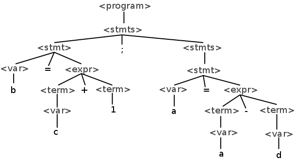
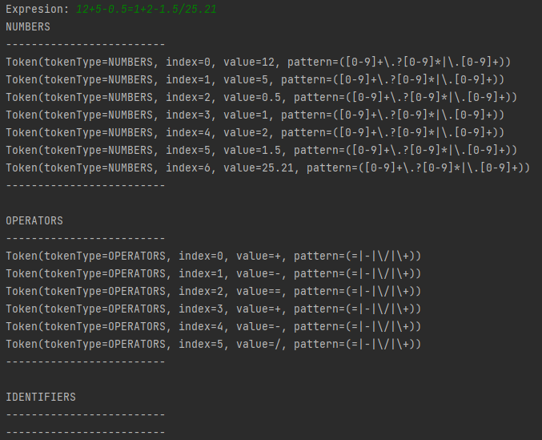
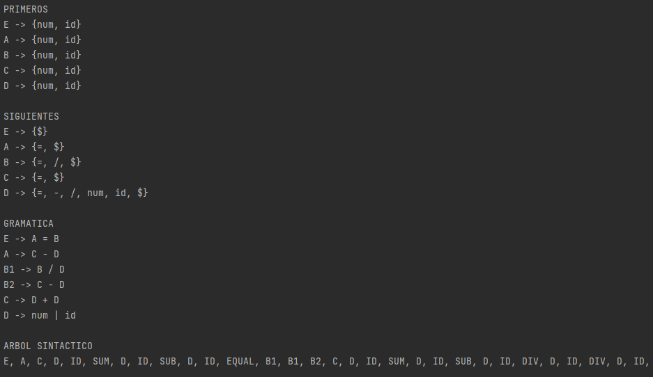
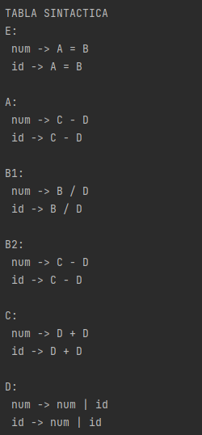
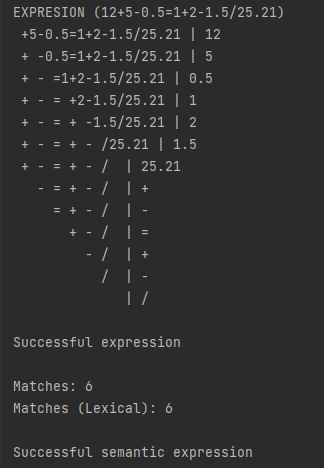
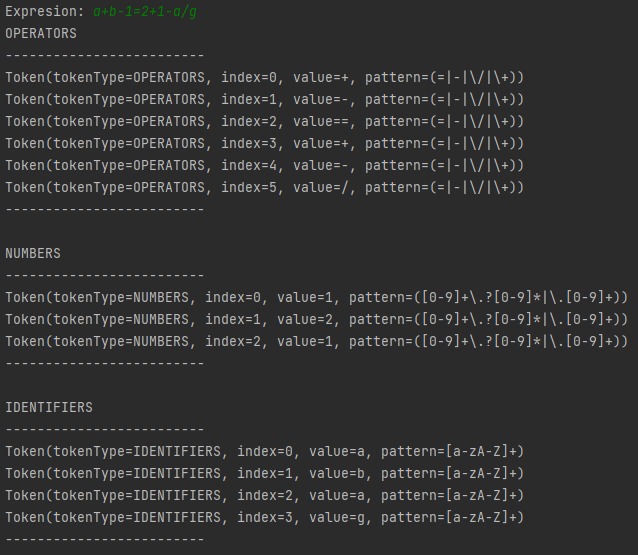
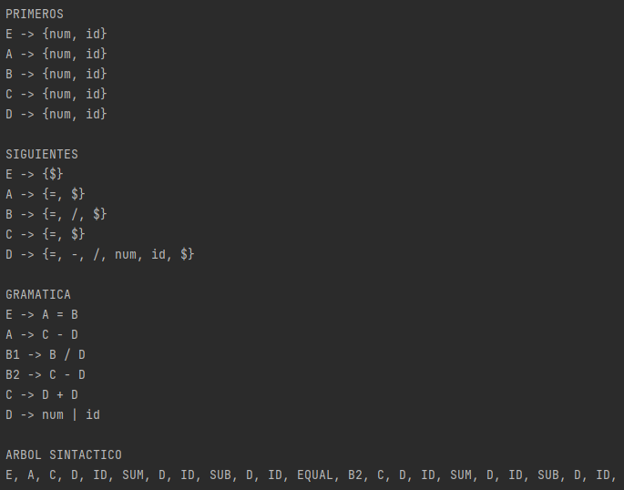
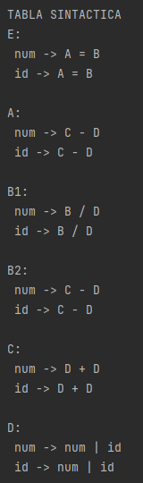
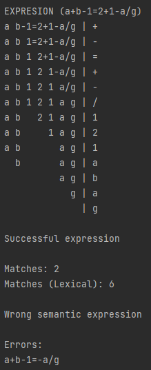

# Parser
Lexical, syntactic and semantic analyzer written in java  

# About
Parser is a lexical, syntactic and semantic analyzer based on a specific lexical expression in order to create sets of flexible grammars.

# Semantic example
Examples will be shown showing the process that is carried out in two cases, one correct and one incorrect.

### Successful
12+5-0.5=1+2-1.5/25.21 
 
 
 
 

### Unsuccessful
a+b-1=2+1-a/g 
 
 
 
 

# Grammar
E -> A=B 
A -> C-D 
B -> B/D 
B -> C-D 
C -> D+D 
D -> num|id 
 
P(E) = {num, id} 
P(A) = {num, id} 
P(B) = {num, id} 
P(C) = {num, id} 
P(D) = {num, id} 
 
S(E) = {$} 
S(A) = {=} 
S(B) = {=, /} 
S(C) = {=} 
S(D) = {$, =, -, /, num, id} 
